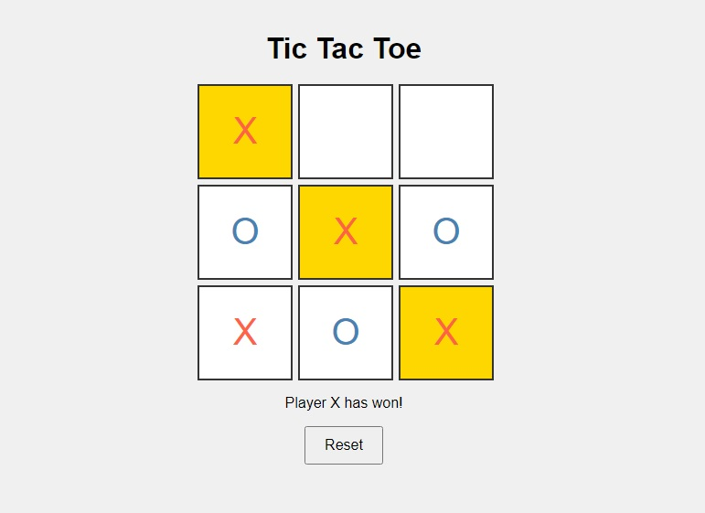

# Tic Tac Toe Game

A simple Tic Tac Toe game built with HTML, CSS, and JavaScript. Two players take turns marking cells in a 3×3 grid. The first player to align three marks horizontally, vertically, or diagonally wins.



## Features

- Two-player mode
- Dynamic turn messages
- Highlight winning line
- Reset button for new games

## How to Play

1. Open `index.html` in a web browser.
2. Players take turns clicking on cells to place their marks.
3. The game announces the winner or a draw.
4. Click the reset button to start a new game.

## Deployment

Deployed via GitHub Pages at: [soliyhan.github.io/tic-tac-toe-ui](https://your-username.github.io/tic-tac-toe)

## Setup

Clone the repository:

```sh
git clone https://github.com/your-username/tic-tac-toe.git
```
